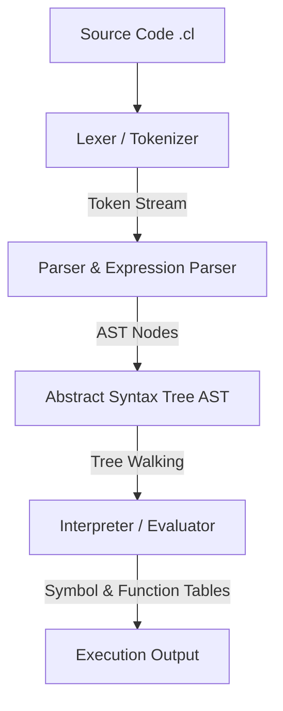

# C-Lite Interpreter Architecture

This document describes the modular compilation and execution pipeline of the C-Lite interpreter.



## Compilation & Execution Pipeline

The C-Lite interpreter is split into distinct stages:

### 1. Lexer (Scanner / Tokenizer)
* **Files**: [lexer.h](file:///home/surya/C-Lite/include/lexer.h), [lexer.c](file:///home/surya/C-Lite/src/lexer.c)
* **Description**: Consumes source code character by character, tracking lines and columns to produce a token stream (`Token`).
* **Key Tasks**:
  - Matches keywords (`int`, `bool`, `char`, `string`, `str`, `if`, `else`, `while`, `echo`, `endl`).
  - Matches operators (`+`, `-`, `*`, `/`, `==`, `!=`, `<`, `>`, `<=`, `>=`, `&&`, `||`, `!`).
  - Processes string, character, and integer literals.
  - Ignores whitespace and single-line comments (`//`).

### 2. Parser & AST Builder
* **Files**: [parser.h](file:///home/surya/C-Lite/include/parser.h), [parser.c](file:///home/surya/C-Lite/src/parser.c), [expr.h](file:///home/surya/C-Lite/include/expr.h), [expr.c](file:///home/surya/C-Lite/src/expr.c), [AST.h](file:///home/surya/C-Lite/include/AST.h), [AST.c](file:///home/surya/C-Lite/src/AST.c)
* **Description**: Employs a recursive-descent parser to consume tokens and construct an Abstract Syntax Tree (AST) composed of typed nodes (`ASTNode`).
* **Structure**:
  - `expr.c` handles expressions with precedence scaling from logical `||` down to primary literals/identifiers.
  - `parser.c` structures statements like declarations, assignments, conditionals, loops, functions, and echo outputs.
  - `AST.c` provides node allocation utilities (`create_block`, `create_var_decl`, `create_if`, etc.).

### 3. Interpreter (Evaluator)
* **Files**: [interpreter.h](file:///home/surya/C-Lite/include/interpreter.h), [interpreter.c](file:///home/surya/C-Lite/src/interpreter.c), [function_table.h](file:///home/surya/C-Lite/include/function_table.h), [function_table.c](file:///home/surya/C-Lite/src/function_table.c)
* **Description**: Walks the AST to execute statements recursively (`exec`) and evaluate expression values (`eval`).
* **Environment**:
  - Handles block-level scoping utilizing a flat symbol stack.
  - Stores user-defined functions in a central function lookup table.

---

## Command Line Interface (CLI)

The interpreter entrypoint is in [main.c](file:///home/surya/C-Lite/src/main.c).

### Compiling
Use the `Makefile` to compile C-Lite using `gcc`:
```bash
make
```

### Running Scripts
```bash
./clite <script_file.cl>
```

### Debug Mode
Run with the `--debug` flag to dump token representations and execution traces:
```bash
./clite <script_file.cl> --debug
```
